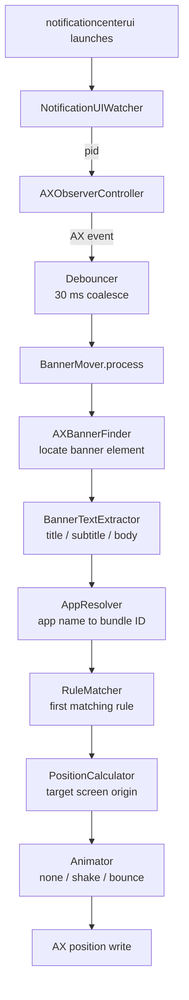

# Architecture

This document explains how BannerShift is structured internally and how a
notification banner travels from "the OS just posted it" to "it's sitting where
you asked." It's aimed at contributors. For the build/test workflow see
[DEVELOPERS.md](../DEVELOPERS.md); for user-visible settings see
[configuration.md](configuration.md).

## The two-target split

The code is split into two SwiftPM targets, and the split is load-bearing.

- **`BannerShiftCore`** (`Sources/BannerShiftCore/`) — a library of pure value
  types and pure logic: coordinate math, rule matching, animation frame
  schedules, the preferences/rules data model, debouncing. It imports no system
  UI frameworks (`AppKit`, `ApplicationServices`, `Cocoa`). Everything here is
  unit-tested in `Tests/BannerShiftCoreTests/`.
- **`BannerShift`** (`Sources/BannerShift/`) — the executable. It owns all
  AppKit and Accessibility (AX) integration: the app delegate, the AX observer,
  the menu-bar UI, the window mover. It is verified by exercising real macOS
  notifications against a built `.app`, not by unit tests.

The boundary is **dependency-based and enforced by imports**:

| | `BannerShiftCore` may import | `BannerShift` (app) may import |
| --- | --- | --- |
| Frameworks | `Foundation`, `CoreGraphics`, `OSLog` | all of Core's, **plus** `AppKit`, `ApplicationServices` (AX), `ServiceManagement`, `UserNotifications` |

The rule of thumb for placing new code: **if a piece of logic could be tested
without a Mac's window server, it belongs in Core.** When something in the
executable target starts to look generally useful and has no UI/AX dependency,
move it down into Core and test it there.

Note that Core is *not* "zero side effects": `FileLogger` writes a file and
`RuleStore`/`Preferences` use `UserDefaults`. Those are allowed because they're
Foundation-only and testable with temp directories / custom defaults suites. The
line is the framework dependency and testability, not strict purity.

### Functional core, imperative shell

The split follows the functional-core / imperative-shell pattern:

- **The app is the imperative shell.** It talks to the messy, stateful OS:
  observes the AX tree, reads `NSScreen`, posts notifications, draws the menu
  bar, and performs the side effects.
- **Core is the pure decision layer.** Value types and deterministic logic, with
  no dependency on the system UI.

The seam between them is a small set of plain value types that the app distills
from system objects and hands to Core:

| App reads (system object) | Distills into (Core value type) |
| --- | --- |
| `NSScreen` | `ScreenInfo` |
| `AXUIElement` window | `AXWindowKey`, `BannerWindowSnapshot` |
| AX text subtree | `BannerText` |

Core then *decides* — `RuleMatcher` (which rule applies), `PositionCalculator`
(the target origin), `AnimationFrames` (the frame schedule) — and the app *acts*
on that decision. A clean illustration of "decide vs. do": Core's
`AnimationFrames` computes the precomputed frame schedule (pure math), while the
app's `Animator` executes that schedule against AX over time on the run loop.

## End-to-end flow

When a banner appears, control flows through these types in order. Everything
below runs on the **main thread** (see [Threading](#threading)).

1. **`NotificationUIWatcher`** observes `NSWorkspace` launch/terminate
   notifications for the system notification UI process
   (`com.apple.notificationcenterui`). When it launches, the watcher hands the
   pid to the app delegate, which brings up an observer. This indirection
   matters because `notificationcenterui` can crash and relaunch; the watcher
   re-attaches when it does.

2. **`AXObserverController`** owns an `AXObserver` for that pid. It registers for
   `kAXWindowCreated`, `kAXCreated`, `kAXUIElementDestroyed`, and
   `kAXLayoutChanged` on the app element and every existing window, and attaches
   the observer's run-loop source to the main run loop. A C trampoline routes
   each AX callback back into Swift. `refreshWindows()` picks up windows created
   after startup and prunes keys for windows that have gone away (so AX pointer
   reuse can't cause a new window to silently miss its notifications).

3. **`Debouncer`** (Core) coalesces event storms with a **leading-plus-trailing**
   strategy over a `Constants.eventDebounceInterval` (30 ms) window. The first
   event after an idle period runs the reposition pass **immediately** (the
   leading edge), which is what catches a banner before it animates into the
   OS-default corner; a pure trailing debounce would wait for the AX storm to go
   quiet and the move would read as a jump. Any subsequent call during the
   window arms or replaces a single coalesced trailing run, which fires when the
   window closes — this catches AX state that arrived after the leading run had
   already executed (for example, a window that existed but whose banner subtree
   wasn't attached yet). The Debouncer itself is AX-agnostic; the AX-state
   framing is the *motivation*. An isolated event fires the action exactly once,
   and a burst fires it at most ~twice per window.

4. **`BannerMover`** runs the pass. For each top-level window of the
   notification UI process it:
   - skips the window if it's the *expanded Notification Center panel* rather
     than a transient banner (via **`NotificationCenterPanelDetector`**, which
     keys off `Constants.notificationCenterPanelIdentifier`), restoring any
     prior move first;
   - finds the banner element with **`AXBannerFinder`** (a depth-limited
     depth-first search for an AX subrole in `Constants.bannerSubroles`);
   - extracts text with **`BannerTextExtractor`** (recursively collects text
     elements, sorts them top-to-bottom, and assigns them to title / subtitle /
     body by a count heuristic);
   - resolves the source app's bundle ID with **`AppResolver`** (a cached
     name → bundle-ID lookup maintained from `NSWorkspace` launch/terminate
     notifications, so it doesn't scan every running app on each banner);
   - asks **`RuleMatcher`** (Core) for the first enabled rule whose patterns all
     match (case-insensitive **wildcard** patterns — `*` = any run, substring
     match, AND across fields); the rule's position and animation override the
     global defaults, otherwise the default position and `none` apply;
   - computes the destination with **`PositionCalculator`** (Core) on the screen
     the banner currently belongs to (chosen by **`DisplaySelector`**), caching a
     **`BannerWindowSnapshot`** of the window's original geometry on first move;
   - if the matched rule's `pinsToList` is set, hands a **`CapturedNotification`**
     to its `onPin` closure (wired by `AppDelegate` to
     `ReminderController.capture(_:)`), which collapses it into the always-on-top
     pinned list. `onPin` fires once, at first sight of the banner, so a banner
     is never pinned twice;
   - dispatches the move through **`Animator`**.

5. **`Animator`** writes the AX position attribute. `none` snaps to the target;
   `shake`/`bounce` snap to target then oscillate around it (horizontal bursts
   and upward hops, respectively). Frame schedules are precomputed by
   `AnimationFrames` (Core) and dispatched as `DispatchWorkItem`s on the main
   queue at precomputed deadlines — nothing is allocated per frame. When a banner
   disappears, `BannerMover` restores the window's original position and drops
   its snapshot.

### Pinned-notifications subsystem

The `onPin` branch above feeds a small subsystem that follows the same
functional-core / imperative-shell split. **`PinnedList`** (Core) is a pure,
in-memory, ordered value type with collapse-by-key semantics: a
`CapturedNotification` is grouped by `(bundleID ?? lowercased appName, title)`,
repeats bump an occurrence count and move the group to the top, and the list is
capped at `Constants.maxPinnedItems` (oldest group evicted on overflow).
**`ReminderController`** (app) owns one `PinnedList` as mutable state and renders
it into a non-activating floating `NSPanel` that sits above other apps, joins all
Spaces, and never steals focus. It re-renders after each mutation (capture,
per-row dismiss, dismiss-all) and persists only the panel's dragged origin to
`Preferences.pinnedPanelOrigin` — never any notification content. See
[pinned-notifications.md](pinned-notifications.md) for the user-facing behavior.

## Key Core types

| Type | Responsibility |
| --- | --- |
| `Position` | The nine grid positions and their string encodings. |
| `Animation` | The three animation styles. |
| `PositionCalculator` | Given screen geometry and a target position, computes the window origin; also holds the full-screen-container invariant check. |
| `AnimationFrames` | Precomputed frame schedules (offsets + integer-snapped points) per style. |
| `RuleMatcher` | Compiles rule patterns once and evaluates them against extracted banner text. |
| `Rule` / `RuleStore` | The rule data model and its persistence. |
| `PinnedList` / `CapturedNotification` | In-memory, collapse-by-key model for the always-on-top pinned list. |
| `Preferences` | Typed accessors over `UserDefaults`. |
| `Debouncer` | Main-queue event coalescing. |
| `FileLogger` | Leveled file logging with a size cap; debug level gated at write time. |
| `Constants` | The single source of truth for OS-dependent magic strings and numbers. |

## Threading

The AX API is synchronous and main-thread-bound. BannerShift leans into that:
the observer's run-loop source is attached to the **main** run loop, every AX
read/write happens on the **main thread**, and the debouncer schedules its pass
on the main queue. Do not introduce `async`/`await` at AX call sites — it would
obscure the threading invariant without buying anything, since the work must run
on main anyway. The only background work is `FileLogger`'s serial write queue.

## OS fragility

BannerShift depends on a handful of undocumented macOS internals. Each is
isolated to a constant in `Sources/BannerShiftCore/Support/Constants.swift` so that when
a macOS major release breaks one, you fix the constant first and then the
dependent logic. When you add a workaround for a new OS version, note the symptom
and the macOS version in a comment on the affected constant.

| Constant | Value | What it identifies |
| --- | --- | --- |
| `notificationUIBundleIdentifier` | `com.apple.notificationcenterui` | The system process that hosts banners. |
| `bannerSubroles` | `AXNotificationCenterBanner`, `AXNotificationCenterAlert` | AX subroles carried by the banner element inside a notification window (never the enclosing window's own subrole). |
| `notificationCenterPanelIdentifier` | `widget-editor` | Present only when Notification Center is expanded; used to avoid moving the panel. |
| `axOrderedChildrenAttribute` | `AXOrderedChildren` | Undocumented AX attribute (no `kAX…` symbol). On macOS 26's SwiftUI notification UI, some descendants are reachable only through this relationship, so `NotificationCenterPanelDetector` walks it alongside `kAXChildrenAttribute`. If Apple renames it, panel detection silently breaks. |
| `dockPadding` | `30.0` pt | Keeps middle/bottom banners clear of the Dock. |
| `eventDebounceInterval` | `0.030` s | AX-event coalescing window. |
| `maxAXRecursionDepth` | `32` | Depth cap when walking the (untrusted) AX subtree. |
| `maxBannerMatchSubjectLength` | `4096` | Caps regex input length to bound backtracking. |

There's also a structural invariant — the full-screen container window that
banners live inside — checked by `PositionCalculator.invariantHolds`. If it stops
holding, `BannerMover` bails out of repositioning that window rather than moving
something it doesn't understand.
